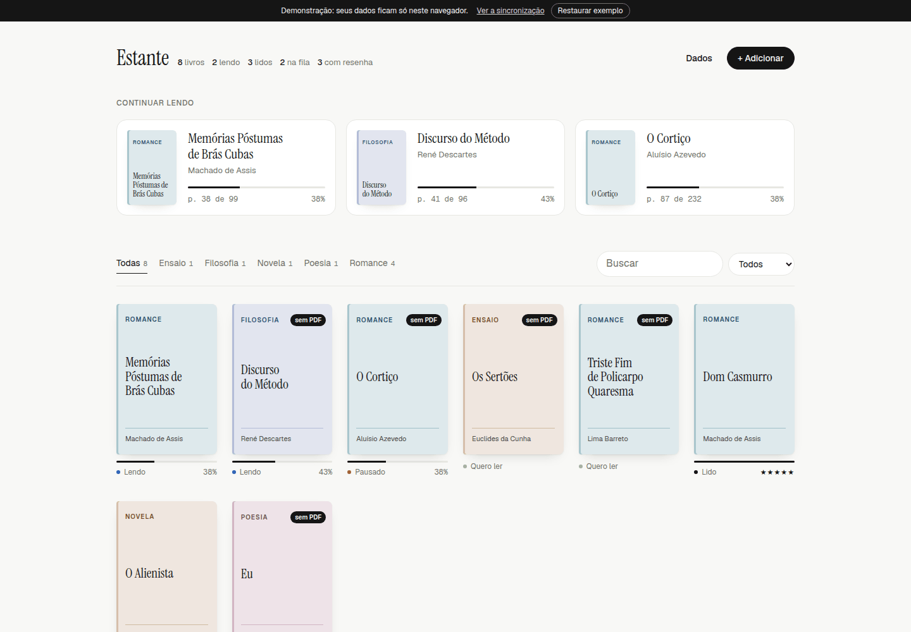
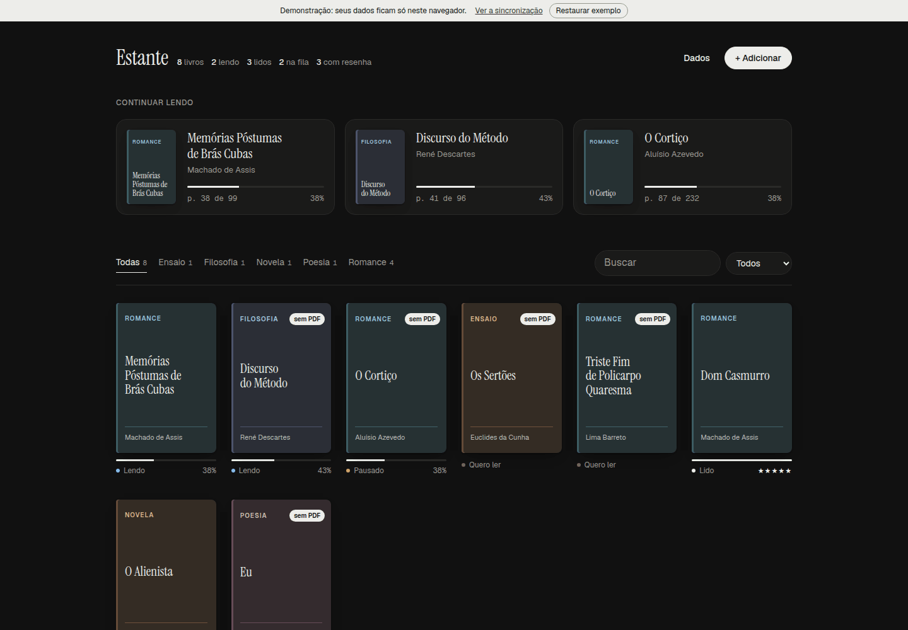
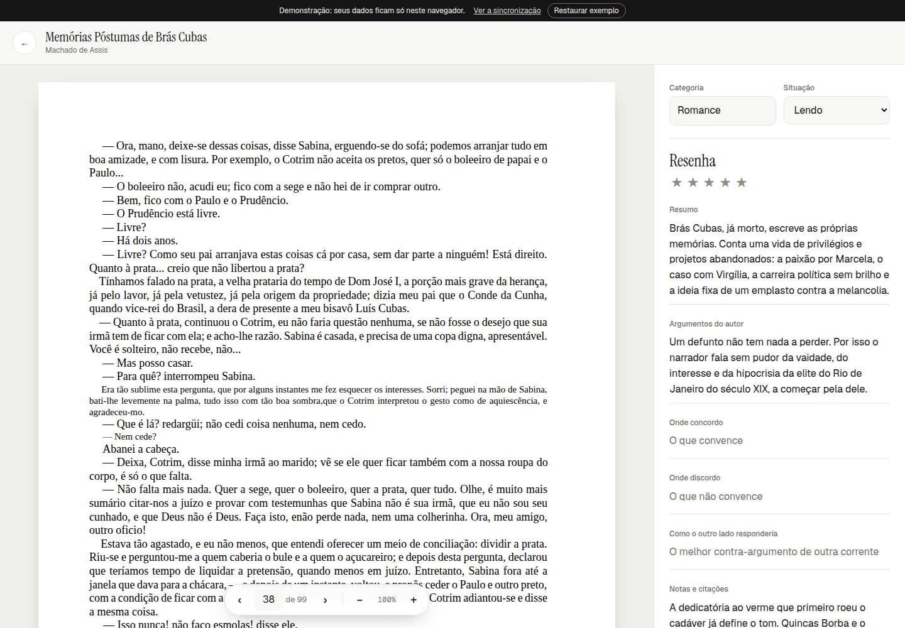
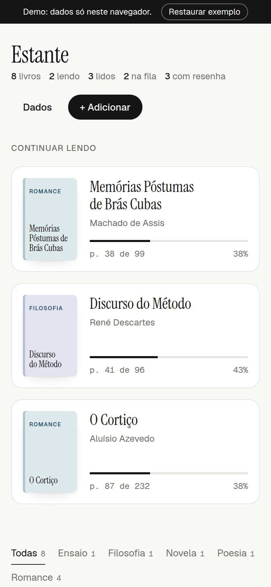
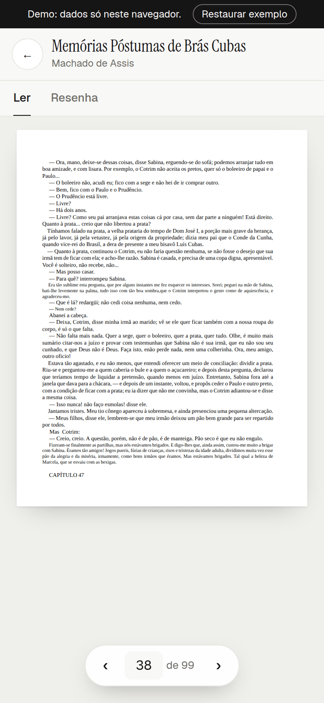
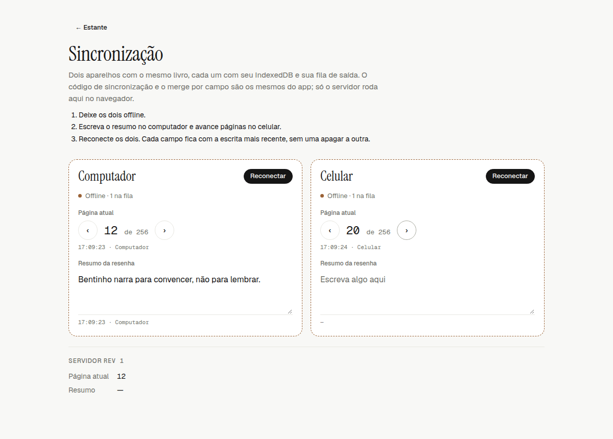
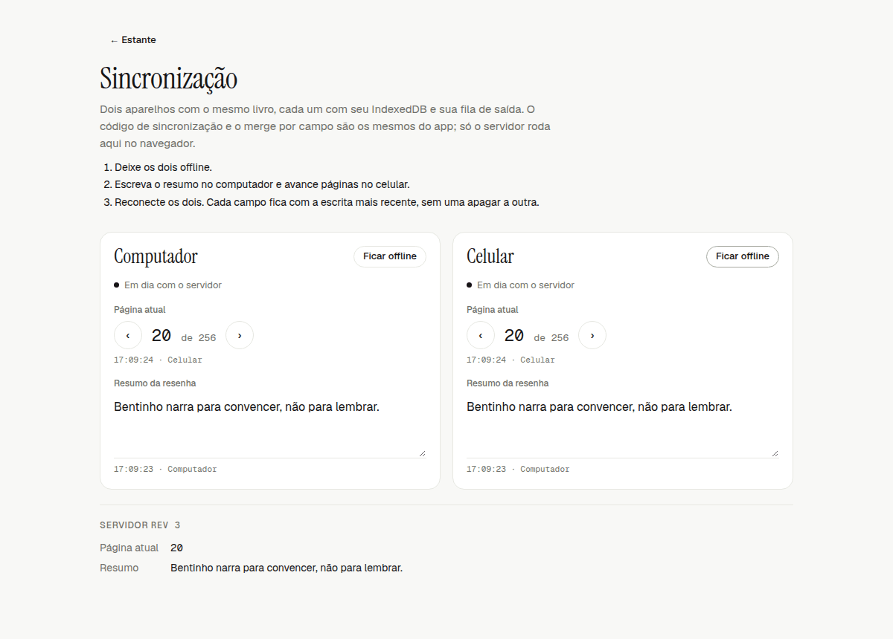
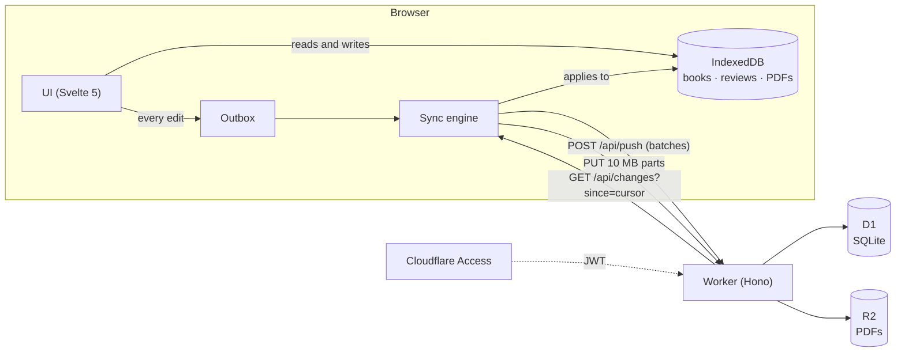
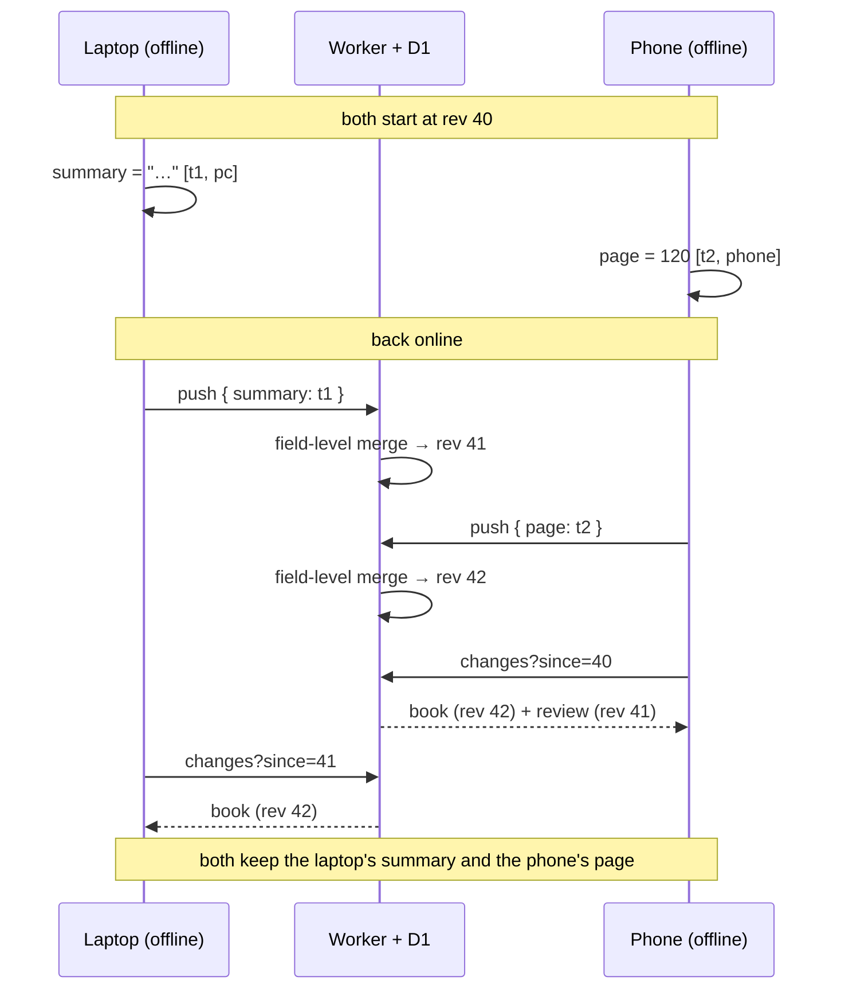

# Estante de Leitura

**English** · [Português](README.pt-BR.md)

A personal PDF library for study: a reader that remembers your page, a structured review per book, and sync across devices that works offline.

**[Open the demo](https://my-library-demo.eliasvictor2452.workers.dev)** (no login; your data stays in your browser). The interface is in Portuguese.

[](https://github.com/EliasVRG/my-library/actions/workflows/ci.yml)
[](LICENSE)



| Dark theme | Reader with review | Phone |
|---|---|---|
|  |  |  |
| **Reader on a phone** | **Sync: two devices offline** | **Sync: after reconnecting** |
|  |  |  |

## Features

- Shelf with filters by category, status (want to read, reading, paused, read) and search; a "Continue reading" row.
- PDF reader (pdf.js) with the current page saved automatically, zoom and arrow keys.
- One review per book: a rating and six fields (summary, author's arguments, where I agree, where I disagree, the best counter-argument, notes).
- Works offline as a PWA. Every PDF you open is kept on the device; you can free space per book.
- Syncs across devices when online, merging field by field.
- Exports a `.zip` with one Markdown review per book and an `estante.json` (PDFs optional), and imports it back. Each PDF can also be saved on its own.
- Single-user access through Cloudflare Access.

## Architecture



The UI never waits for the network: it only reads from and writes to IndexedDB. Every edit also goes into an outbox, which the sync engine sends in batches when there is a connection (when the network comes back, when the window gains focus, and every minute). The Worker serves the app as static assets and answers under `/api/*`. It merges changes into D1 and stores PDFs in a private R2 bucket. To receive changes, the app asks the server for everything that changed since its last cursor.

## How sync works

**Field-level merge.** Every field of a book or a review carries a `[timestamp, device]` clock for its last write. On conflict, the larger timestamp wins and the device id breaks ties. So turning pages on the laptop and writing the review on the phone don't overwrite each other: they are different fields. Several edits to the same record collapse into one outbox entry holding the latest value of each field, so turning 30 pages produces one request, not 30.

**The cursor comes from the server.** Every write to D1 gets an increasing revision (`rev`), and a pull asks for `rev > cursor`. If the cursor were the device clock, a phone running behind could skip changes that landed while it thought it was up to date. Device clocks only decide who wins within a field. When applying a pull, the client takes the server's value for every field that has no pending local edit, so all devices converge to the same state.

**Deletes beat edits.** A deleted book becomes a tombstone (`deleted_at`) that propagates to other devices. After that, no edit brings it back, not even a later edit from another device or a backup import. The Worker also clears the review and deletes the PDF from R2.

**Resumable multipart upload.** The PDF is stored on the device and the book shows up right away. The upload is queued as an R2 multipart upload in 10 MB parts, and each finished part is recorded in IndexedDB. If the connection drops, the upload resumes from the next part. If the upload expires in R2 (after 7 days), it starts over. The upload only starts after the book itself has reached the server, and if the PDF is replaced midway, the old upload is discarded.



The [`/demo/sync`](https://my-library-demo.eliasvictor2452.workers.dev/demo/sync) page runs this scenario with the real code (`LocalStore`, `SyncEngine` and the merge in `shared/merge.ts`). Only the server runs inside the browser.

## Decisions and trade-offs

- **A Worker with static assets instead of Pages.** This is what Cloudflare's docs recommend for new projects today. The app, the API, D1 and R2 live in one deploy and one config. The cost is configuring the SPA fallback explicitly, along with which routes reach the Worker (`run_worker_first: ["/api/*"]`).
- **Svelte 5 with no UI library.** A small runtime and rune-based reactivity. The production app's initial JS is 48 KB gzipped (measured below). The cost is a smaller ecosystem than React's, which mattered little for an app this size.
- **Cloudflare Access instead of custom auth.** There are no passwords, sessions or login screen in the code. The Worker only validates the Access JWT: signature, `iss`, `aud` and the allowed email. The costs:
  - the app is tied to Cloudflare and has a single user;
  - redirect-based login doesn't mix well with a PWA that serves the app from cache. When the session expires, the app sends you to `/api/login`, a route the service worker doesn't intercept, and Access asks you to log in again.
- **Field-level merge instead of record-level last-write-wins.** It handles the real case (review on one device, reading on another) with little code and no per-character metadata. **Limitation:** the same text field edited offline on two devices is not merged; the most recent write wins as a whole. For truly collaborative text I would use a CRDT (Yjs or Automerge) for the review fields, at the cost of more metadata and a less simple export format.
- **Device clocks order writes.** A device whose clock runs ahead can win a conflict it shouldn't. The server caps timestamps at 60 s in the future, but a device running behind still loses conflicts. A hybrid logical clock (HLC) would fix this at a small cost in complexity.
- **Permanent deletes.** Simple and predictable, but there is no trash and no undo.

Other known limitations:
- The reader draws one page at a time on a canvas, with no text layer. You can't select or search text in the PDF.
- The whole PDF is loaded into memory for pdf.js. Very large files are heavy on a phone.
- Each push carries at most 20 records, because D1 on the free plan allows 50 queries per request.

## Testing

```sh
npm test        # Vitest: 57 tests
npm run check   # svelte-check + tsc for the Worker
```

- **`tests/unit/merge.test.ts` (20 tests):** field-level merge, tie-breaking, deletes winning over edits, convergence with a clock running ahead, and validation of incoming changes.
- **`tests/unit/sync.test.ts` (18 tests):**
  - the outbox: collapsing page turns, retry with backoff, edits made during a push, an invalid item not blocking the rest, expired session and denied login;
  - two devices converging;
  - resumable multipart upload.
- **`tests/unit/demo.test.ts` (5 tests):** the sample data, "Restore sample" and the serverless mode.
- **`tests/worker/api.test.ts` (14 tests):** Worker routes running in workerd with local D1 and R2. They cover push/changes, CAS, deletes removing the PDF from R2, multipart upload with Range reads, and Access JWT validation (with keys generated in the test).

Client tests run in Node with `fake-indexeddb` and the same in-memory server used by the `/demo/sync` page. CI runs `check`, `test` and both builds. The demo build fails if any emitted file contains `/api/` (`scripts/check-demo-bundle.mjs`).

End-to-end browser flows (two devices, offline, upload, delete) were tested with Playwright during development, but those scripts aren't in the repo. `npm run screenshots` walks through the demo, including the sync on the `/demo/sync` page.

**Bundle size**, measured with `gzip -9 -c <file> | wc -c` on the output of `npm run build` (Vite 8.3.2, 2026-10-05):

| File | Raw | gzip -9 |
|---|---|---|
| App initial JS | 134 KB | 48 KB |
| CSS | 24 KB | 5.6 KB |
| pdf.js (loaded when a book is opened) | 431 KB | 127 KB |
| pdf.js worker | 1.26 MB | 375 KB |

## Running locally

Requires Node 22.13+ and npm 11 (npm 10 fails to install without a lockfile; with `package-lock.json`, `npm ci` works).

```sh
npm install
cp .dev.vars.example .dev.vars   # DEV_SKIP_ACCESS=1: skips Access, localhost only
npm run db:migrate:local
npm run dev                      # app + Worker in workerd, with local D1 and R2
npm run dev:demo                 # the demo, no Worker
```

`npm run preview` tests the production build with `wrangler dev`, service worker included.

## Deploying

### Production

1. Create the database with `npx wrangler d1 create estante`. When wrangler offers to edit the config, answer **no** and paste the `database_id` into `wrangler.jsonc`.
2. Enable R2 in the dashboard, then run:
   ```sh
   npx wrangler r2 bucket create estante-pdfs
   npm run db:migrate:remote
   npm run deploy
   ```
   Or connect the repo under *Workers & Pages → Builds*, with `npm run build` as the build command.
3. In the Worker's **Access** tab, protect **All traffic** with an *Allow → Emails → your email* policy.
4. Set the secrets from the values shown in the Access dialog:
   ```sh
   npx wrangler secret put ACCESS_TEAM_DOMAIN   # https://<your-team>.cloudflareaccess.com
   npx wrangler secret put ACCESS_AUD           # <application aud>
   npx wrangler secret put ALLOWED_EMAIL        # <your email>
   ```
   Without the secrets, the API rejects every request.

New migrations go in `migrations/` and are applied with `npm run db:migrate:remote` before deploying. To back up the database: `npx wrangler d1 export estante --remote --output=backups/estante.sql`.

### Demo

1. Download the three sample PDFs from [dominiopublico.gov.br](http://www.dominiopublico.gov.br) and save them to `demo/pdfs/` using the names in [`demo/pdfs/README.md`](demo/pdfs/README.md). Check with `npm run demo:pdfs`.
2. Run `npm run deploy:demo`. It publishes `dist-demo/` to the `my-library-demo` Worker as static assets only: no D1, no R2, no Access.
3. `npm run screenshots` regenerates the images in this README.

## License

[MIT](LICENSE)
