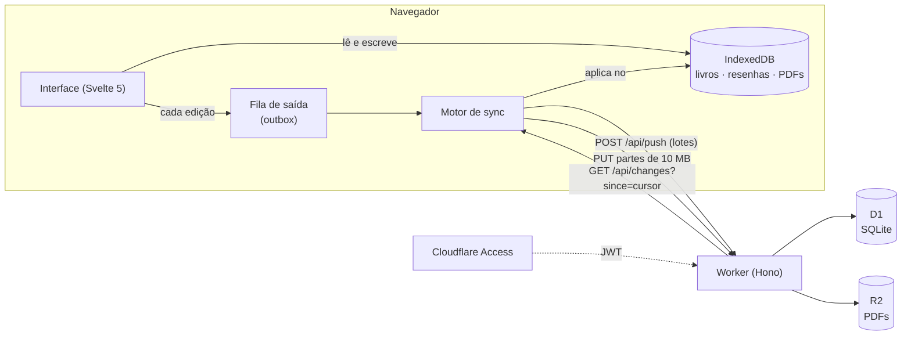
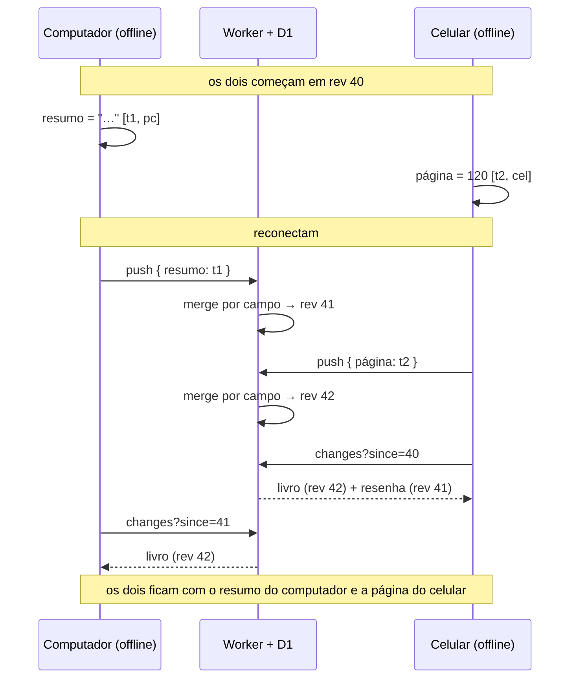

# Estante de Leitura

[English](README.md) · **Português**

Biblioteca pessoal de PDFs para estudo: leitor que lembra a página, resenha estruturada por livro e sincronização entre aparelhos que funciona offline.

**[Abrir a demo](https://my-library-demo.eliasvictor2452.workers.dev)** (sem login; os dados ficam só no seu navegador)

[](https://github.com/EliasVRG/my-library/actions/workflows/ci.yml)
[](LICENSE)


| Tema escuro | Leitor com resenha | Celular |
|---|---|---|
|  |  |  |
| **Leitor no celular** | **Sync: dois aparelhos offline** | **Sync: depois de reconectar** |
|  |  |  |

## Funcionalidades

- Estante com filtros por categoria, situação (quero ler, lendo, pausado, lido) e busca; faixa "Continuar lendo".
- Leitor de PDF (pdf.js) com página salva automaticamente, zoom e setas do teclado.
- Resenha por livro: nota e seis campos (resumo, argumentos, onde concordo, onde discordo, contra-argumento, notas).
- Funciona offline como PWA. Todo PDF aberto fica guardado no aparelho; dá para liberar espaço por livro.
- Sincroniza entre aparelhos quando há conexão, com merge por campo.
- Exporta um `.zip` com uma resenha em Markdown por livro e um `estante.json` (PDFs opcionais), e importa de volta. Cada PDF também pode ser salvo isoladamente.
- Acesso de um único usuário pelo Cloudflare Access.

## Arquitetura



A interface nunca espera a rede: lê e grava só no IndexedDB. Cada edição também entra numa fila de saída, que o motor de sincronização envia em lotes quando há conexão (ao voltar a rede, ao focar a janela e a cada minuto). O Worker serve o app como arquivos estáticos e responde em `/api/*`. Ele faz o merge das alterações no D1 e guarda os PDFs no R2, que é privado. Para receber mudanças, o app pede ao servidor tudo o que mudou desde o último cursor.

## Como a sincronização funciona

**Merge por campo.** Cada campo de um livro ou de uma resenha guarda um relógio `[timestamp, aparelho]` da última escrita. Num conflito vence o maior timestamp, e o id do aparelho desempata. Assim, avançar páginas no computador e escrever a resenha no celular não se sobrescrevem: são campos diferentes. Na fila de saída, várias edições do mesmo registro viram uma só, com o valor mais recente de cada campo. Por isso virar 30 páginas gera uma requisição, não 30.

**O cursor vem do servidor.** Toda escrita no D1 recebe uma revisão crescente (`rev`), e o pull pede `rev > cursor`. Se o cursor fosse o relógio do aparelho, um celular com a hora atrasada poderia pular mudanças que chegaram enquanto ele achava que estava em dia. Os relógios dos aparelhos só decidem quem vence dentro de um campo. Ao receber dados, o cliente aceita o valor do servidor em todo campo sem edição local pendente; assim, todos convergem para o mesmo estado.

**Exclusão vence edição.** Um livro excluído vira uma lápide (`deleted_at`) que se propaga para os outros aparelhos. Depois disso, nenhuma edição o traz de volta, nem uma feita mais tarde em outro aparelho nem uma importação de backup. O Worker apaga também a resenha e o PDF no R2.

**Upload em partes, com retomada.** O PDF é guardado no aparelho e o livro aparece na hora. O upload entra na fila como um multipart do R2, em partes de 10 MB, e cada parte enviada fica registrada no IndexedDB. Se a conexão cair, o envio continua da parte seguinte. Se o upload expirar no R2 (7 dias), recomeça do zero. O upload só começa depois que o livro chegou ao servidor, e, se o PDF foi trocado no meio, o envio antigo é descartado.



A página [`/demo/sync`](https://my-library-demo.eliasvictor2452.workers.dev/demo/sync) mostra esse cenário com o código real (`LocalStore`, `SyncEngine` e o merge de `shared/merge.ts`). Só o servidor roda no próprio navegador.

## Decisões e trade-offs

- **Worker com static assets em vez de Pages.** É o que a documentação da Cloudflare recomenda hoje para projetos novos. App, API, D1 e R2 ficam num deploy e numa configuração só. O preço é configurar explicitamente o fallback de SPA e quais rotas passam pelo Worker (`run_worker_first: ["/api/*"]`).
- **Svelte 5 sem biblioteca de UI.** Runtime pequeno e reatividade com runes. O JS inicial do app de produção tem 48 KB com gzip (medição abaixo). O preço é um ecossistema menor que o do React, o que pesou pouco num app desse tamanho.
- **Cloudflare Access em vez de autenticação própria.** Não há senha, sessão nem tela de login no código. O Worker só valida o JWT do Access: assinatura, `iss`, `aud` e o e-mail permitido. Os preços:
  - o app fica preso à Cloudflare e é de um único usuário;
  - o login por redirect não combina com um PWA que serve o app do cache. Quando a sessão vence, o app manda o usuário para `/api/login`, rota que o service worker não intercepta, e o Access pede o login de novo.
- **Merge por campo em vez de "último vence" por registro.** É o que resolve o caso real (resenha num aparelho, leitura no outro) com pouco código e sem metadados por caractere. **Limitação:** o mesmo campo de texto editado offline nos dois aparelhos não é mesclado; vence a escrita mais recente inteira. Para texto colaborativo de verdade, eu usaria um CRDT (Yjs ou Automerge) nos campos da resenha, ao custo de mais metadados e de um formato menos simples de exportar.
- **Relógio do aparelho para ordenar escritas.** Um aparelho com a hora adiantada pode vencer um conflito que não deveria. O servidor limita timestamps a no máximo 60 s no futuro, mas um aparelho atrasado continua perdendo conflitos. Um relógio lógico híbrido (HLC) resolveria isso, com um pouco mais de complexidade.
- **Exclusão definitiva.** É simples e previsível, mas não há lixeira nem "desfazer".

Outras limitações conhecidas:
- O leitor desenha uma página por vez num canvas, sem camada de texto. Não dá para selecionar nem buscar texto no PDF.
- O PDF inteiro é carregado em memória para o pdf.js. Arquivos muito grandes pesam no celular.
- Cada envio leva no máximo 20 registros, porque o D1 do plano gratuito permite 50 queries por requisição.

## Testes

```sh
npm test        # Vitest: 57 testes
npm run check   # svelte-check + tsc do Worker
```

- **`tests/unit/merge.test.ts` (20 testes):** merge por campo, desempate, exclusão vencendo edição, convergência com relógio adiantado e validação das alterações recebidas.
- **`tests/unit/sync.test.ts` (18 testes):**
  - fila de saída: agrupamento de páginas viradas, reenvio com backoff, edição feita durante o envio, item inválido que não trava os outros, sessão expirada e login recusado;
  - dois aparelhos convergindo;
  - upload em partes com retomada.
- **`tests/unit/demo.test.ts` (5 testes):** dados de exemplo, "Restaurar exemplo" e o modo sem servidor.
- **`tests/worker/api.test.ts` (14 testes):** rotas do Worker rodando no workerd com D1 e R2 locais. Cobrem push/changes, CAS, exclusão apagando o PDF do R2, upload multipart com leitura por Range e validação do JWT do Access (com chaves geradas no teste).

Os testes de cliente rodam em Node com `fake-indexeddb` e o mesmo servidor em memória da página `/demo/sync`. O CI roda `check`, `test` e os dois builds. O build da demo falha se algum arquivo gerado contiver `/api/` (`scripts/check-demo-bundle.mjs`).

Os fluxos completos no navegador (dois aparelhos, offline, upload, exclusão) foram testados com Playwright durante o desenvolvimento, mas esses scripts não estão no repositório. O `npm run screenshots` percorre a demo, inclusive a sincronização da página `/demo/sync`.

**Tamanho do bundle**, medido com `gzip -9 -c <arquivo> | wc -c` sobre a saída do `npm run build` (Vite 8.3.2, em 05/10/2026):

| Arquivo | Bruto | gzip -9 |
|---|---|---|
| JS inicial do app | 134 KB | 48 KB |
| CSS | 24 KB | 5,6 KB |
| pdf.js (carregado ao abrir um livro) | 431 KB | 127 KB |
| worker do pdf.js | 1,26 MB | 375 KB |

## Rodar localmente

Requer Node 22.13+ e npm 11 (o npm 10 falha ao instalar sem lockfile; com o `package-lock.json`, `npm ci` funciona).

```sh
npm install
cp .dev.vars.example .dev.vars   # DEV_SKIP_ACCESS=1: pula o Access, só em localhost
npm run db:migrate:local
npm run dev                      # app + Worker no workerd, com D1 e R2 locais
npm run dev:demo                 # a demo, sem Worker
```

`npm run preview` testa o build de produção com `wrangler dev`, incluindo o service worker.

## Deploy

### Produção

1. Crie o banco com `npx wrangler d1 create estante`. Quando o wrangler perguntar se deve editar a configuração, responda **não** e cole o `database_id` em `wrangler.jsonc`.
2. Ative o R2 no painel e rode:
   ```sh
   npx wrangler r2 bucket create estante-pdfs
   npm run db:migrate:remote
   npm run deploy
   ```
   Ou conecte o repositório em *Workers & Pages → Builds*, com build command `npm run build`.
3. No painel do Worker, aba **Access**, proteja **All traffic** com uma política *Allow → Emails → seu e-mail*.
4. Configure os segredos com os valores da janela do Access:
   ```sh
   npx wrangler secret put ACCESS_TEAM_DOMAIN   # https://<seu-time>.cloudflareaccess.com
   npx wrangler secret put ACCESS_AUD           # <aud da aplicação>
   npx wrangler secret put ALLOWED_EMAIL        # <seu e-mail>
   ```
   Sem os segredos, a API recusa todas as requisições.

Migrações novas vão em `migrations/` e são aplicadas com `npm run db:migrate:remote` antes do deploy. Para backup do banco: `npx wrangler d1 export estante --remote --output=backups/estante.sql`.

### Demo

1. Baixe os três PDFs de exemplo em [dominiopublico.gov.br](http://www.dominiopublico.gov.br) e salve em `demo/pdfs/` com os nomes de [`demo/pdfs/README.md`](demo/pdfs/README.md). Confira com `npm run demo:pdfs`.
2. Rode `npm run deploy:demo`. Ele publica `dist-demo/` no Worker `my-library-demo`, só com arquivos estáticos: sem D1, sem R2 e sem Access.
3. `npm run screenshots` regenera as imagens deste README.

## Licença

[MIT](LICENSE)
